# Online Store Description

The project presents a complete online shop application with an advanced purchasing process. The application includes browsing products, managing the cart, placing an order, and handling the user account. Below are the described views with examples.

## 1. Home Page
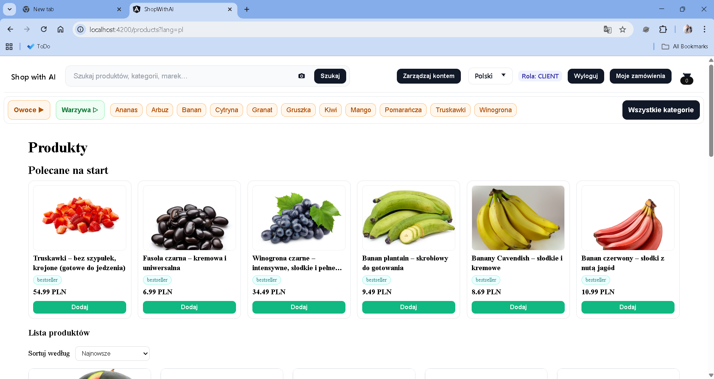  
Presentation of main categories, promotional banners, and a search bar. The user can quickly move to products of interest.  
Additionally, the store supports **semantic search**, which allows finding products based on the meaning of the query, not only exact keyword matches.  
It is also possible to use **image search** – the user can upload a photo of a product, and the system will find the most relevant items.

---

## 2. Product List
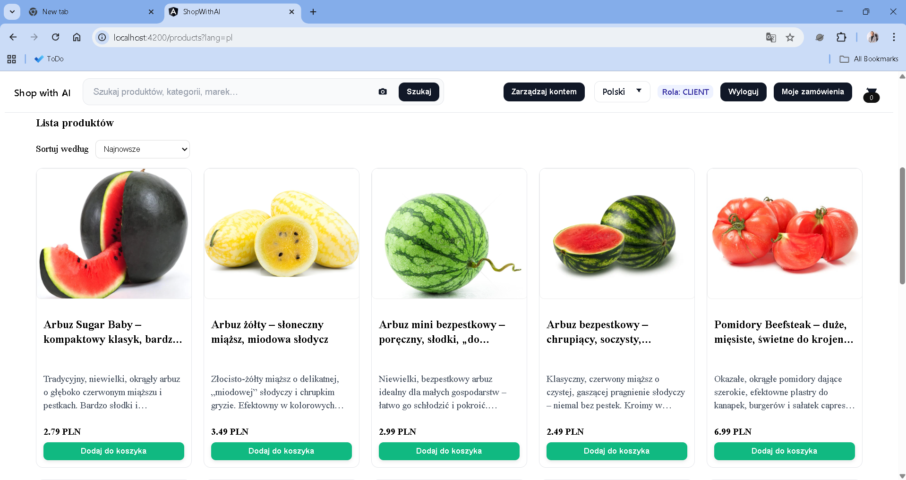  
The product list view allows quick browsing of available products. It shows basic information (name, price, photo).

### 2.1 Sorting
  
The sorting function allows displaying products by price, popularity, or date added.

---

## 3. Product Details
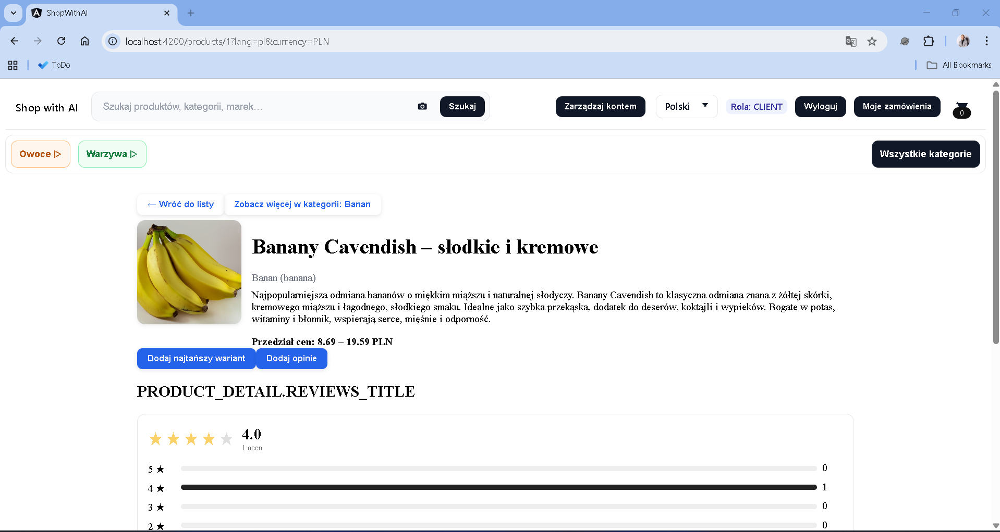  
The product page contains a detailed description, photo gallery, price, and purchase buttons.

### 3.1 Variants
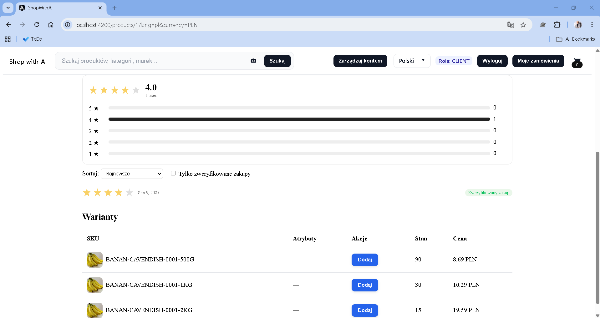  
Possibility to choose different product options, e.g., size or weight.

### 3.2 Adding Reviews
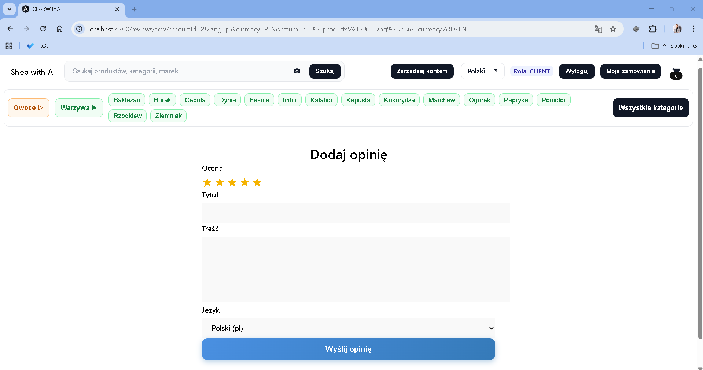  
A review form with star rating, title, content, and language selection. Reviews increase the credibility of the store.

---

## 4. Product Categories
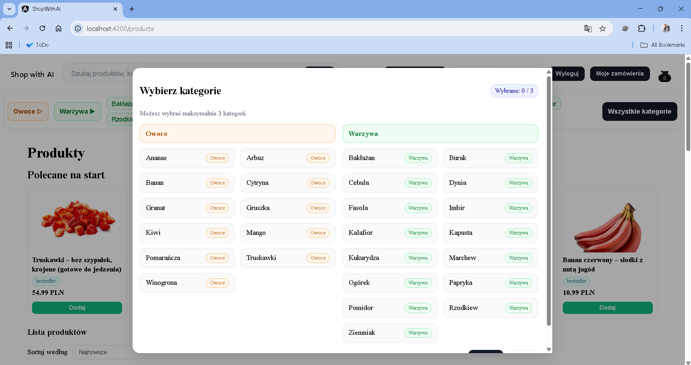  
An overview of the full list of categories available in the store, making it easier to filter products.

---

## 5. Cart
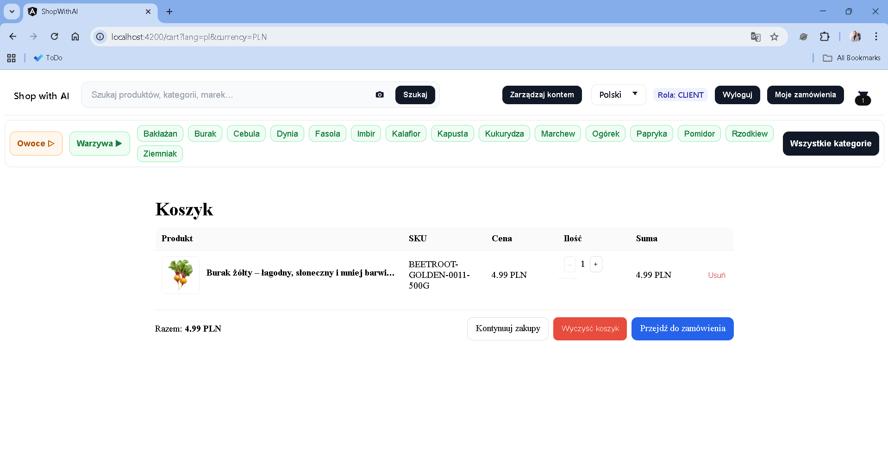  
The cart view shows:
- list of selected products,
- option to change quantity,
- price and delivery cost preview,
- option to proceed to checkout.

---

## 6. Order Process

The order process is divided into four main steps to ensure clarity and simplicity for the user.

### 6.1 Customer Data
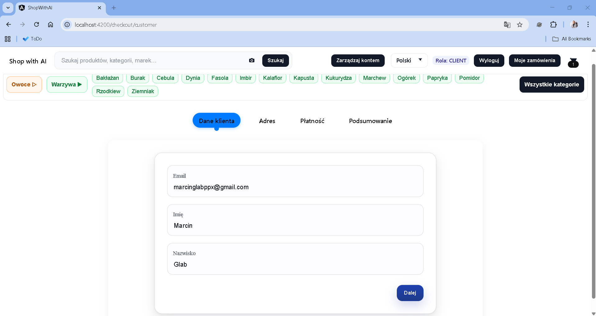  
Personal data form – first name, last name, e-mail.  

### 6.2 Delivery Data
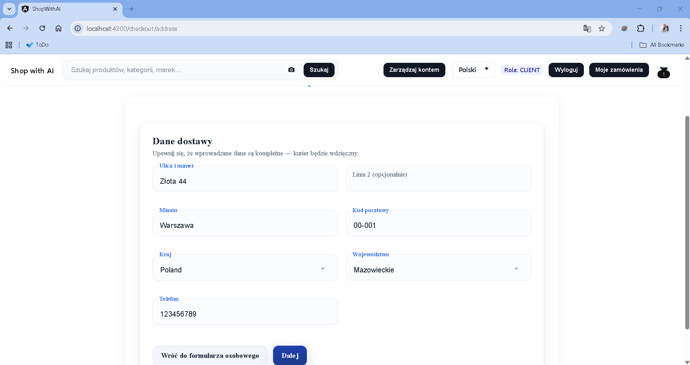  
Address form – street, city, postal code, country, phone.  

### 6.3 Payment
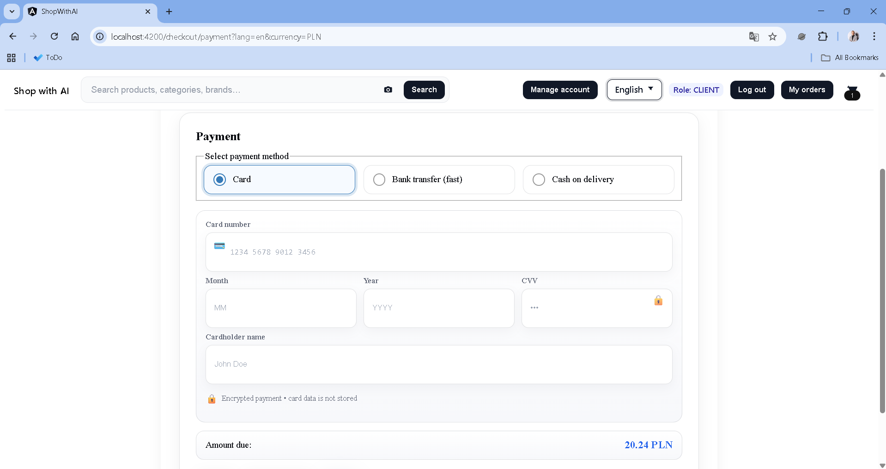  
Choice of payment method: card, instant transfer, or cash on delivery.  
For card payments – transaction authorization details.  

### 6.4 Summary
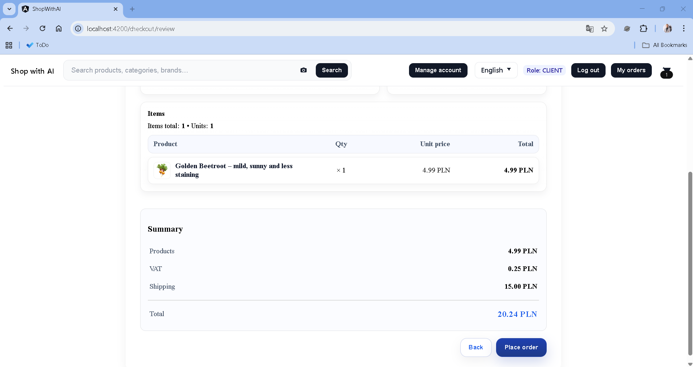  
List of products, VAT and delivery costs, and the final amount. The user completes the purchase by clicking **"Place Order"**.

---

## 7. My Orders
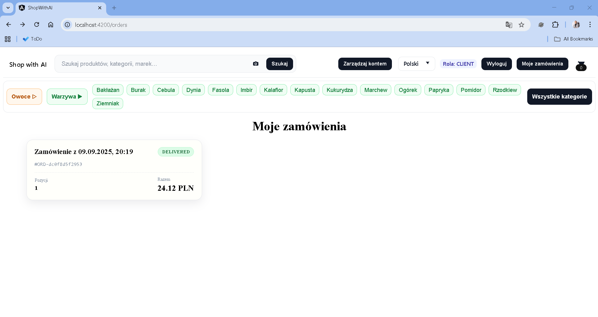  
The user’s purchase history. Each order has a status and the option to view details.

### 7.1 Order Details
  
The view contains a list of products, delivery address, order status, and payment method.

---

## 8. User Account
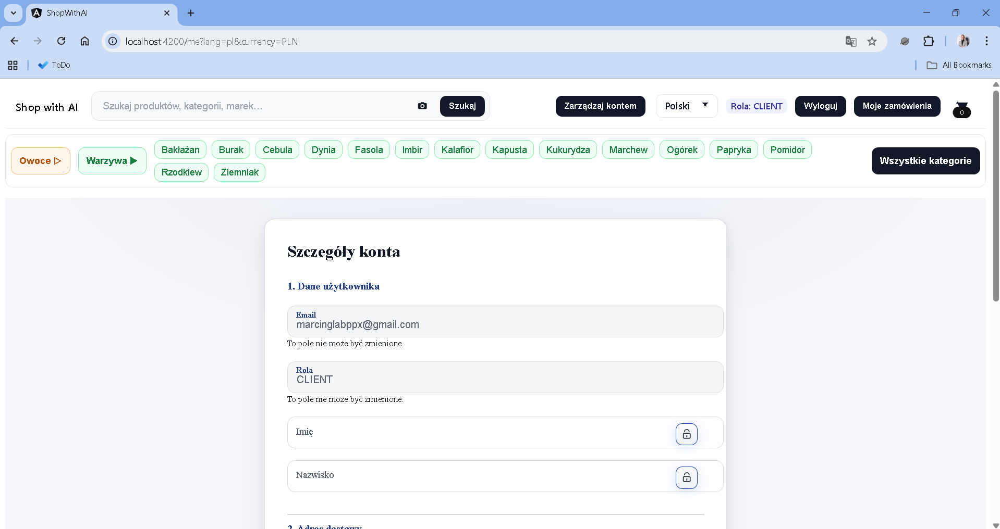  
The user panel, where one can manage:
- personal data,
- addresses,
- order history,
- account settings.

---

# Summary

The application has all elements of a modern online store:
- product search with categories,
- product list and details with variants,
- cart and multi-step order process,
- payment support,
- possibility to add reviews,
- user panel with order history.

The system is ready for integration with payment gateways, logistics systems, and offer personalization modules.
